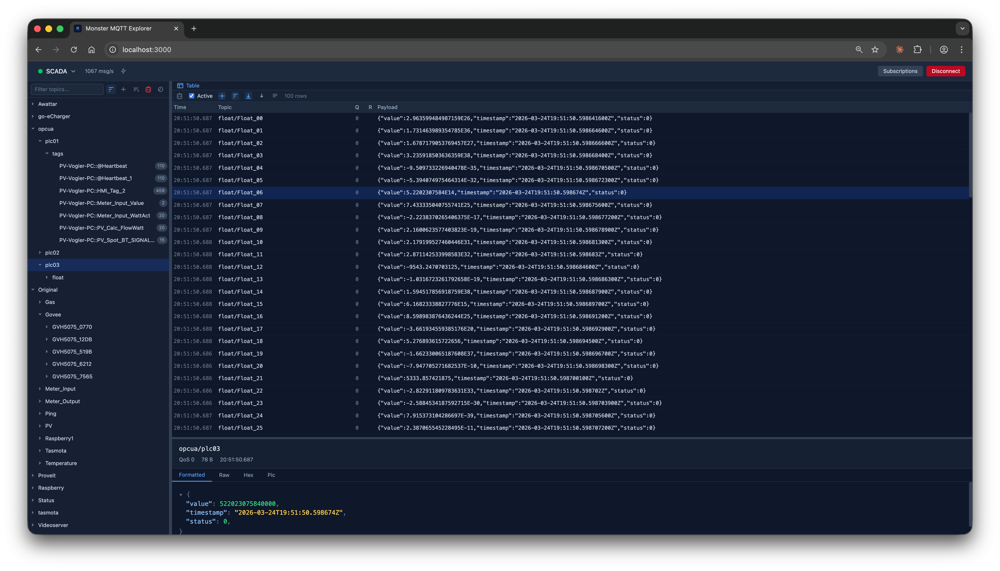

# Monster MQTT Explorer

A high-performance MQTT client built for developers who need more than just a message list.

Born out of frustration with existing tools that grind to a halt once the topic tree starts filling up — Monster stays fast no matter how many topics or messages come in.



## Why Monster?

Existing MQTT browsers struggle under real-world loads. Monster runs MQTT in a **Web Worker** so the UI thread never freezes, and uses **virtual scrolling** so the topic tree handles thousands of nodes without breaking a sweat.

## Features

### Topic Tree
- Virtual scrolling — thousands of topics, no slowdown
- Hierarchical tree with expand/collapse
- Auto-expand as new topics arrive
- Filter by topic name
- Filter to show only retained messages
- Sort alphabetically
- Expand all / clear selected subtree
- Message count badges per node

### Message Table
Two modes for different workflows:

**Live mode** — one row per topic, always showing the latest value. Great for monitoring many sensors at once. Rows flash when updated so you spot changes instantly.

**History mode** — every message recorded. Scroll back through time, click any row, and see the full details in the pane below.

Table controls:
- Enable/disable logging independently of the view
- Configurable max rows (history mode)
- Auto-scroll toggle
- Sort by topic name or time
- Newest-first or oldest-first order
- Resizable columns
- Single-line or full multiline payload display

### Message Detail
Inspect any message with multiple views:
- **Formatted** — JSON with syntax highlighting, plain text fallback
- **Raw** — plain text
- **Hex** — byte-level inspection
- **Pic** — render the payload as an image (JPEG, PNG, GIF, WebP, BMP). Live mode auto-updates as new frames arrive.

### Connection Management
- Multiple saved connections
- Quick-switch dropdown in the toolbar
- Live subscription management — add/remove/edit subscriptions while connected, changes take effect immediately and persist to the connection config
- Clear retained messages with one click

### Other
- Flash on update (tree + table) — toggleable
- Progressive Web App — no install needed, works offline
- Dark theme

## Getting Started

```bash
npm install
npm run dev
```

Open [http://localhost:3000](http://localhost:3000).

## Build

### Web / PWA

```bash
npm run build
npm run preview
```

Open [http://localhost:3000](http://localhost:3000) in Chrome or Edge. Click the install icon in the address bar to install as a Progressive Web App.

### Electron (Desktop)

```bash
# Preview without packaging
npm run electron:preview

# Build distributable
npm run build:electron:mac   # → release/*.dmg (arm64 + x64)
npm run build:electron:win   # → release/*.exe (x64)
npm run build:electron       # both platforms
```

## Tech Stack

- [Solid.js](https://solidjs.com) — reactive UI without virtual DOM overhead
- [Tailwind CSS v4](https://tailwindcss.com) — utility-first styling
- [Vite](https://vitejs.dev) — fast dev server and build
- [mqtt.js](https://github.com/mqttjs/MQTT.js) — MQTT client (runs in Web Worker)
- [@tanstack/solid-virtual](https://tanstack.com/virtual) — virtual scrolling

## Architecture

MQTT runs in a Web Worker and batches incoming messages every ~16ms before sending them to the main thread via zero-copy `Uint8Array` transfers. This keeps the UI responsive even at thousands of messages per second.

```
MQTT Broker → Worker (batches msgs) → App → topic tree store → UI
```

See [CLAUDE.md](CLAUDE.md) for a detailed architecture overview.

## License

MIT © 2026 Andreas Vogler
